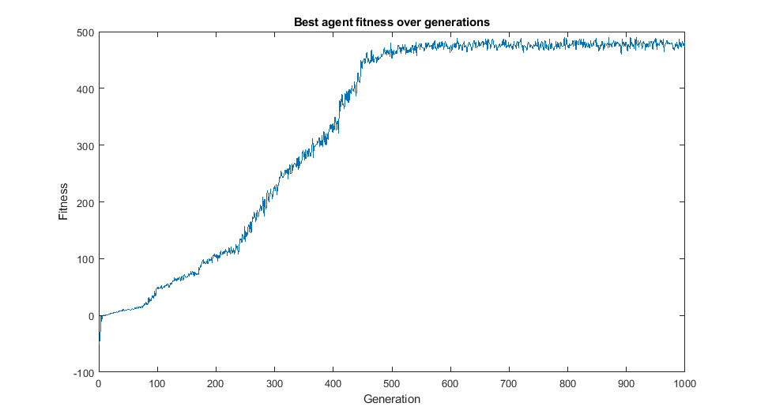
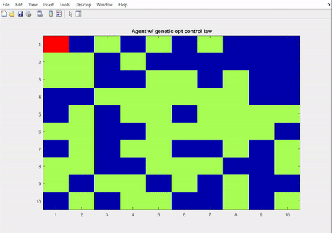
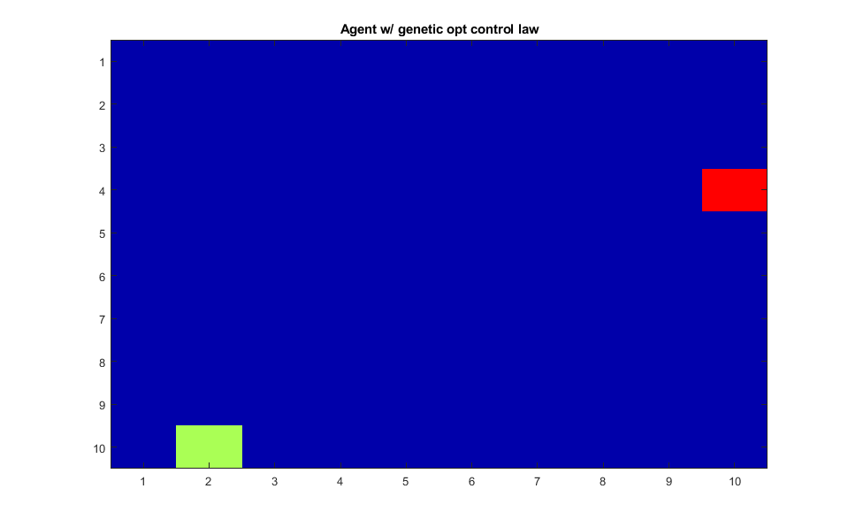
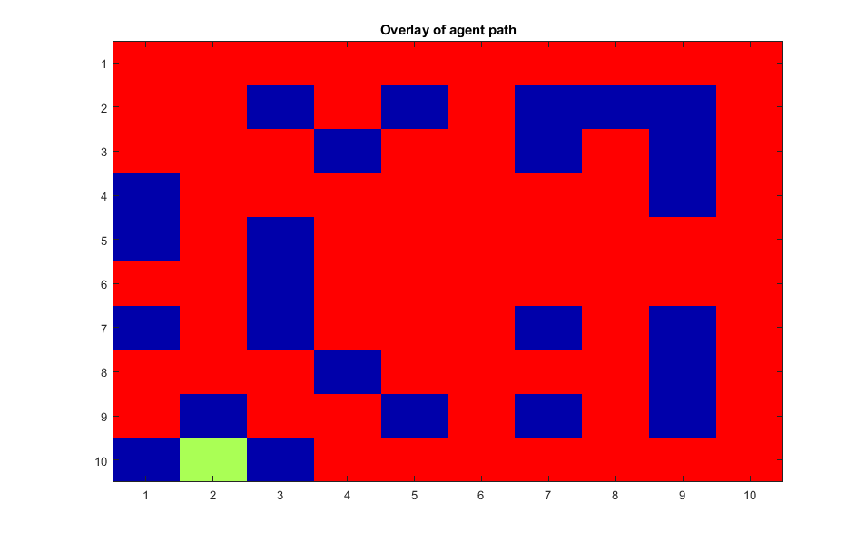

# basic_genetic_algo_robot
Implement genetic algorithm to search for a near-optimal control law for a simple agent

World description:
- Map is 10x10 discrete tiles
- Each tile is either: empty (blue), reward (green), wall (perimeter)
- Agent can sense the tiles in its immediate surroundings (up, down, left, right, current)
- Agent (red) can perform 1 action per turn: move (up, down, right, left), stay, random, pick-up
- Agent can perform 200 actions in sequence in a single session

Optimizer description:
- State-space is 3^5 = 243
- Population is 200 agents each with its own strategy (genome)
- Fitness is determined via cost and reward: +10 -- pickup reward, -1 -- pickup not a reward, -5 -- hit wall
- Agent fitness is average over 100 simulations, each map randomized, per generation
- Agent average fitness, 0-shifted and squared, is used to determine reproduction probability
- Top 10 "elite" agents' genomes are passed to the next generation automatically
- Reproduction splits two parents genomes at random location, reconnects in two possible ways, then random mutation is applied

Things to note about final control law:
- Agents do not run into perimeter
- Agents do not greedily pickup rewards
- Agents use rewards and chains of rewards as markers and return
- The default search pattern when no reward is seen is to hug the perimeter (could improve on this, Levy-search generally seen in nature)
- There are some tiles that the agents do not visit, not all rewards are collected.

##### Average agent fitness per generation

##### Final configuration

##### Path overlay of agent search

